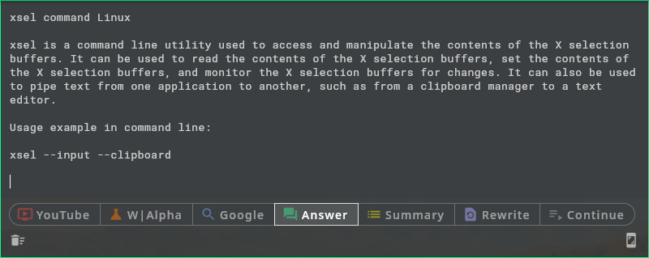

# Assistant

A quick access popup window for advanced text operations, powered by OpenAI.

Put text in the main text form from:
* typing
* screen capture

and get for it: answer, summary, etc. Or search in browser.



Usage:
* App stays in background in tray
* Meta+Space: open/close assistant window
* F1..F7 or action button: perform action on text and put the result below
* Ctrl+PrintScreen, or screen capture button: select screen area to capture text from

Window height adjusts to short texts.


## Running the app

### Desktop, Linux

Requirements: 
* Java
* tesseract-ocr (for capturing text from screen)

Initial config:
* Write an OpenAI API key to `~/.openai-credentials`

Run:
```
./gradlew run
```


## Development

UI: Jetpack Compose


## License

[MIT License](LICENSE)
